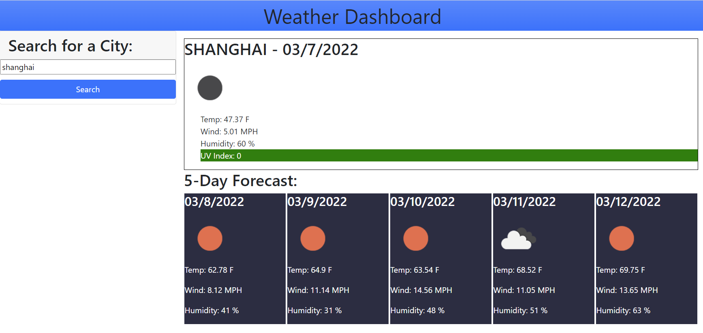

# weather-dashboard

## Purpose

This project was a class assignment in which I was tasked to use the OpenWeather One Call API to retrieve weather data and display it on the screen based on what city the users searches for

## Built With

* HTML
* CSS
* JavaScript

## Website

https://samw281.github.io/weather-dashboard/

## Screenshot

## Contributions

* Sam W (https://github.com/samw281)